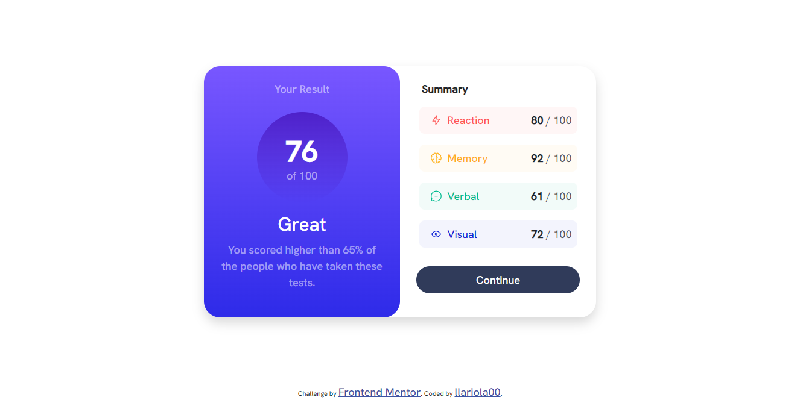

# Frontend Mentor - Results summary component solution

This is a solution to the [Results summary component challenge on Frontend Mentor](https://www.frontendmentor.io/challenges/results-summary-component-CE_K6s0maV). Frontend Mentor challenges help you improve your coding skills by building realistic projects.

## Table of contents

- [Overview](#overview)
  - [The challenge](#the-challenge)
  - [Screenshot](#screenshot)
  - [Built with](#built-with)
  - [What I learned](#what-i-learned)
  - [Useful resources](#useful-resources)
- [Author](#author)

**Note: Delete this note and update the table of contents based on what sections you keep.**

## Overview

### The challenge

Users should be able to:

- View the optimal layout for the interface depending on their device's screen size
- See hover and focus states for all interactive elements on the page

### Screenshot

### Built with

- Semantic HTML5 markup
- JavaScript fundamentals
- CSS custom properties
- [Bootstrap](https://getbootstrap.com/) - Bootstrap 5.3.0

### What I learned

I learned a lot of things from this 1st challenge. As a someone with a bit of experience in HTML, CSS and Bootstrap (just enough to make a basic website), I assumed I'll only take 1-2 hours doing this challenge after seeing the preview. But Oh boy, I was awfully wrong. It took me around 8 hours (spanning 3 days) to finish this one. And I cherished every minute of it.

Now, there are two (2) main things I learned from this challenge, and the reason why it took me so long to finish it:

1. First is compiling Bootstrap from source. I've never done this before, and I'm glad I did it. It took me roughgly 1H 30min. to search, read documentation, and dive forums to barely do it. I'm still not sure if I did it correctly, but hey, it works, so I'm happy. The reason why I did this is because I wanted to customize the Bootstrap break-points, as the default ones are not enough for this challenge. I wanted to make the break-points at 375px, but the default ones are at 576px.

2. Second is dealing with JSON files, and using JavaScript to parse it. While it only took me 30min. to search how to do it, the syntax for setting html element values using JavaScript took a lot of time. Whilst the bulk of my 8 hours got eaten up by looking up for the right Bootstrap classes and syntax.

### Useful resources

- [w3schools](https://www.w3schools.com)
- [JavaScript HTML DOM](https://www.w3schools.com/js/js_htmldom.asp)
- This helped me big time searching for the right HTML and CSS syntax. This is also where I learned the DOM manipulation using JavaScript.

## Author

- Frontend Mentor - [@llariola00](https://www.frontendmentor.io/profile/llariola00)
